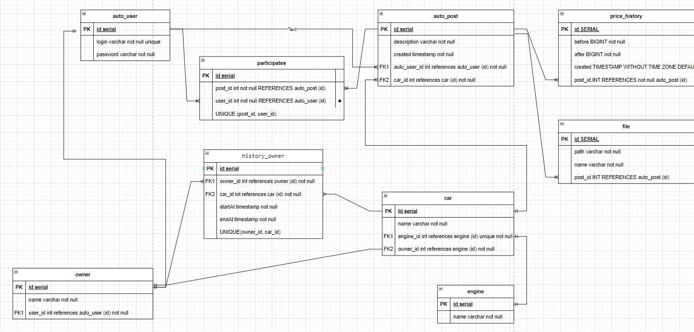

# job4j_cars
## Project on course job4j.ru
### Description
* In project implement cars shop.

### Author
Viacheslav Osipov  
[slavaosipov1199@gmail.com](mailto:slavaosipov1199@gmail.com)  
[LinkedIn](https://www.linkedin.com/in/viacheslav-osipov-67806ab3/)

### Technologies
Spring Boot, Hibernate, PostgreSQL, H2, Liquibase, Lombok, Thymeleaf, Bootstrap, Mockito 

### Patterns
Model View Controller(MVC), Command

### Environment
Java 17, Maven 3.9.2, PostgreSql 16

### Database Diagram
