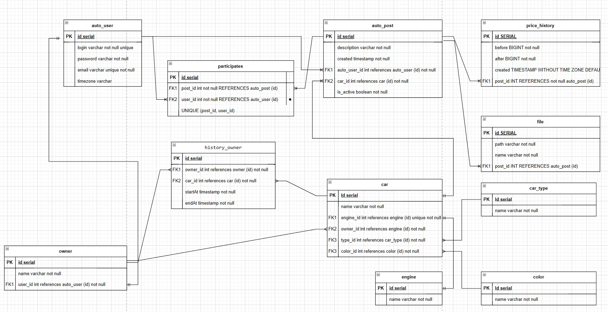

# job4j_cars
## Project on course job4j.ru
### Description
* In project implement cars shop.
* This application is car marketplace with posts about sale cars from owners.
* There is User authorisation by Session. User has own timezone. DateTime is kept in GMT+0 timezone.
* Owner can publish Post with Car. Only owner can edit post and car information.
* All users see Posts. There are filters.
* Owner of Post can change current Price. There are Price History for Post.

### Author
Viacheslav Osipov  
[slavaosipov1199@gmail.com](mailto:slavaosipov1199@gmail.com)  
[LinkedIn](https://www.linkedin.com/in/viacheslav-osipov-67806ab3/)

### Technologies
Spring Boot, Hibernate, PostgreSQL, H2, Liquibase, Lombok, Thymeleaf, Bootstrap, Lombok, Slf4j, Mapstruct, Mockito

### Code coverage: 70%

### Patterns
Model View Controller(MVC), Data Transfer Object (DTO)

### Environment
Java 17, Maven 3.9.2, PostgreSql 16

### Database Diagram
